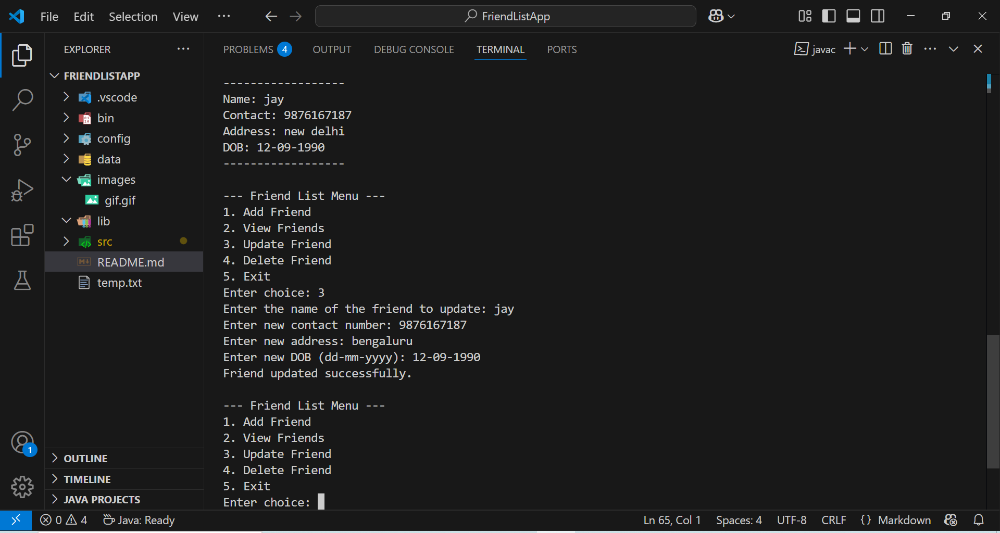
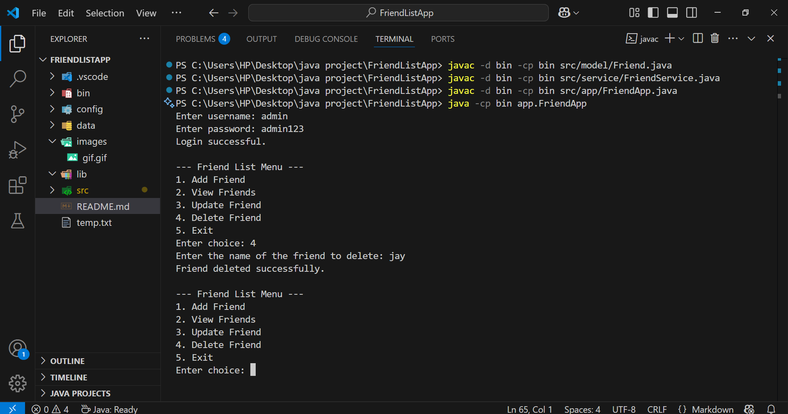
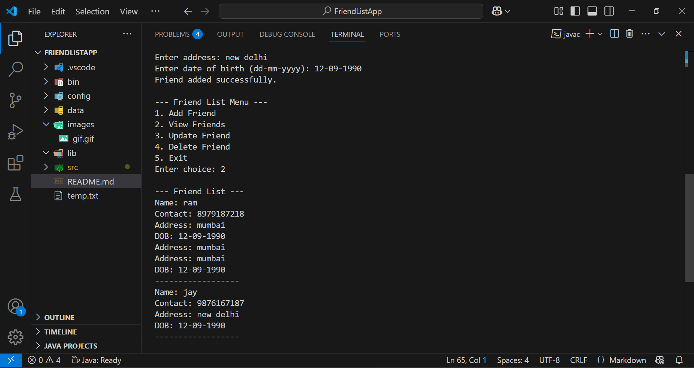

# Friend List App
## Java based CLI project that allows users to manage their list of friends.

### What does this project does:
Here users can add, update, view and delete their friend details with a simple login.
In other words, managing your friends list using the basic CRUD operations.

## 💡Features:
- **Login**: Users must log in with a username and password stored in a properties file.
- **CRUD Operations:** Users can Add, View, Update, and Delete friends.
- **User-Specific Files:** Each user's friend list is saved in a separate `.txt` file.
- **File-Based Storage:** No database required — all data is stored and retrieved using simple file I/O.
- **Modular Code Structure:** Clean separation of concerns using packages like `model`, `service`, and `app`.

## 📦 Concepts & Technologies Used

- Java 23

- Command-line interface (CLI)

- Java Basics – Classes, methods, control structures

- Object-Oriented Programming (OOP) – Encapsulation, classes (`Friend`, `FriendService`), object manipulation

- File Handling – Reading/writing user data to `.txt` files using BufferedReader, BufferedWriter, File, etc.

- Exception Handling – Use of try-catch blocks for robust file I/O operations

- Scanner Class – For user input via the CLI

- Java Properties File – Login credentials stored in a .properties config file

- Directory Structure – Modular codebase with proper separation: `model`, `service`, `app`, `config`, `data`

- Simple Authentication – Username-password login system using Java Properties

## 📁Project Structure:
<pre> FriendListApp/ ├── bin/ # Compiled .class files ├── src/ # Source code │ ├── app/ # Main application entry point │ ├── model/ # Friend model │ ├── service/ # Business logic │ └── config/ # Configuration files (app.properties) ├── data/ # Stores user-specific friend list files ├── assets/ # Images, GIFs, and other media files └── README.md # Project documentation </pre>


## 🔑 Login Credentials

Usernames and passwords are stored in the `src/config/app.properties` file.

Example `app.properties`:

username: admin
password: admin123

## 🚀 How to Run:

### Step 1: Compile the Code:
Open terminal or PowerShell and navigate to your project root. Run:

`javac -d bin src/model/*.java src/service/*.java src/app/*.java`

### Step 2: Run:

``` bash
cd bin
java app.FriendApp
```

### Example Demonstration:
Implementation of the Add a friend function:


Implementation of the Update a friend function:



Implementation of the Delete a friend function:



Implementation of the View a friend function:



## 🎯 Project Purpose:
### A little insight to how this project was build:
I made this project as part of a Java programming assignment given by our professor. The goal was to create a functional command-line based application that manages a user's friend list. It allowed us to apply key object-oriented programming (OOP) concepts and Java I/O operations in a practical setting.
